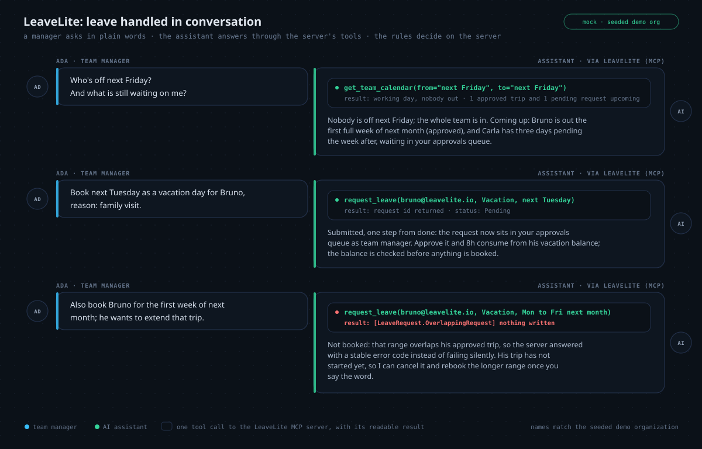
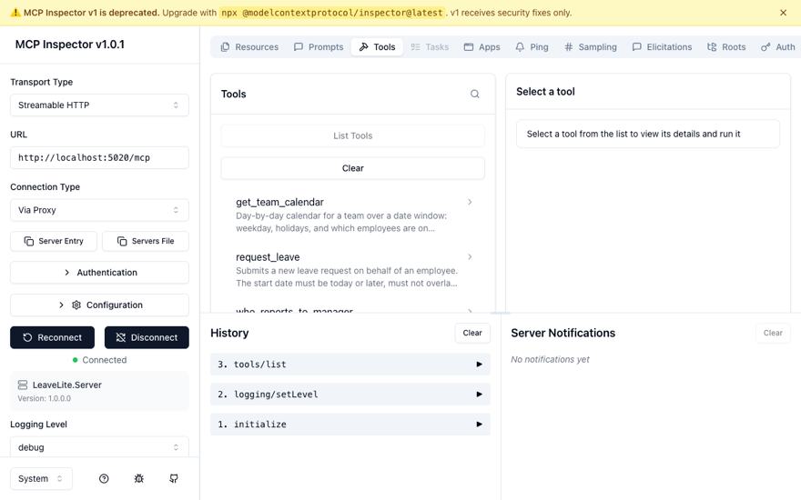
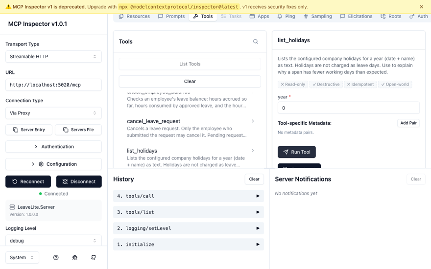

# LeaveLite MCP

[](https://learn.microsoft.com/en-us/dotnet/core/whats-new/dotnet-10/overview)
[](https://learn.microsoft.com/en-us/dotnet/csharp/whats-new/csharp-14)
[](https://modelcontextprotocol.io)
[](https://github.com/Alex5350/leavelite-mcp/actions/workflows/ci.yml)
[](LICENSE)

**Let your team's AI assistant answer leave questions and book time off, with the rules a real
HR system fights about.**

> **Two ways to read this page.** Not an engineer? Everything below the pictures stays in plain
> language, and jargon links to the [glossary](docs/GLOSSARY.md). Engineer? The deep dive lives
> in [TECHNICAL.md](TECHNICAL.md): architecture, request flow, the full tool catalog, and every
> major decision mapped back to the business problem it solves.

## The problem

Leave balances and policies live in HR portals nobody checks conversationally. A manager planning
next week's staffing plans blind: "who's off next Friday?" should be one question, not five
dashboard visits and a spreadsheet cross-check. And booking leave means re-keying rules the HR
system already knows: tenure gates before anyone accrues, carry-over caps at the year boundary,
holidays that must not consume balance, minimum staffing, and who actually has the authority to
approve.

LeaveLite MCP puts the leave system where the team already works: the chat with the AI assistant.
Questions get answered from the real data, and bookings run through the real rules on the server,
where they cannot be misremembered or talked around.

## The product in pictures

<p align="center">
  
</p>

*A mock conversation (the names match the seeded demo organization): the manager asks in plain
words, each outlined chip is one tool call to the LeaveLite server, and every answer comes back
grounded in the rules. Approval is still required, the balance is checked before anything is
booked, and an overlap is rejected with a stable code the assistant can explain.*

The two shots below are the developer view of the same thing, captured live from Anthropic's
[MCP Inspector](https://modelcontextprotocol.io/docs/tools/inspector) connected to this server:
the tool catalog with the descriptions AI clients read, and a real `check_employee_balance`
execution returning Ada's computed balance.

| MCP Inspector: the tool catalog | MCP Inspector: a live tool call |
|:---:|:---:|
|  |  |

## What it delivers

- **Balances and team calendars answerable in plain questions.** "Who's off next Friday?" or
  "What will Carla's vacation balance be in December?" is answered from the same data and rules
  the server enforces.
- **Bookings that respect the rules a real HR system fights about.** [Tenure gates](docs/GLOSSARY.md),
  [carry-over caps](docs/GLOSSARY.md), holiday-aware consumption,
  [approval authority](docs/GLOSSARY.md) and [minimum staffing](docs/GLOSSARY.md): all enforced
  server-side, before anything is written.
- **Nothing becomes a booking without an approval.** Requests land in the team manager's queue;
  approving consumes balance, and only a same-team manager can decide.
- **Errors surface as readable results, not crashes.** Every failure carries a stable code such
  as `[LeaveRequest.OverlappingRequest]` plus a plain sentence, so the assistant can explain why
  an action was refused instead of guessing.
- **Works with standard AI assistant clients.** Any client that speaks the
  [Model Context Protocol](docs/GLOSSARY.md) (Claude Desktop, Claude Code, IDE agents) can
  connect: one standard instead of one plugin per assistant.

A sample of what the assistant can call; the full catalog of 10 tools, 3 resources and 1 prompt
is in [TECHNICAL.md](TECHNICAL.md#the-mcp-surface):

| Tool | Purpose |
|---|---|
| `check_employee_balance` | Accrued, consumed and available hours per leave type |
| `request_leave` | Submit a request, already checked for overlap and balance |
| `list_pending_approvals` | A manager's queue with dates, hours and reasons |
| `decide_leave_request` | Approve or deny, enforcing authority and minimum staffing |
| `get_team_calendar` | Who is out, with holidays and working days, for any date window |

## How the engineering solves it

Plain-terms bridge; each item links to the full story in [TECHNICAL.md](TECHNICAL.md).

- **The assistant cannot "remember" the policy wrong.** The business rules live in the server,
  not the model: every tool call runs the same domain rules any other interface would run, so a
  booking is checked against the real policy, not the assistant's recollection of it.
  ([how the tech solves the business problem](TECHNICAL.md#how-the-tech-solves-the-business-problem))
- **Approvals cannot be talked around.** The approval workflow is enforced server-side: a
  request moves from Pending to Approved only through a manager decision that re-checks authority
  and minimum staffing, so no phrasing in the chat can skip the queue.
  ([the leave-request lifecycle](TECHNICAL.md#request-and-data-flow))
- **The balance math has to be exactly right, on any date.** Accrual is a deterministic
  computation with the clock injected, so the same inputs always yield the same balance, and
  "as of any date" is a parameter, not a guess.
  ([the accrual engine](TECHNICAL.md#how-the-tech-solves-the-business-problem))
- **"Works with the official client" has to be tested, not hoped.** The server is verified at the
  protocol level with the official MCP client, the same path Claude Desktop takes, so the
  handshake, discovery and write flows are known to work end to end.
  ([testing](TECHNICAL.md#testing))

<details>
<summary><b>For developers: quickstart and connecting a client</b></summary>

Requires the [.NET 10 SDK](https://dotnet.microsoft.com/download/dotnet/10.0). Nothing else.

```bash
git clone https://github.com/Alex5350/leavelite-mcp.git
cd leavelite
dotnet run --project src/LeaveLite.Server
# info: Now listening on: http://localhost:5020   (MCP: /mcp, health: /health)
```

First run migrates SQLite and seeds a demo organization: five employees
(`ada@leavelite.io` is the manager), three accrual policies, the 2026 holiday calendar and
sample requests dated relative to *run time* so the demo never goes stale.

**Claude Desktop / Claude Code**: add to the MCP configuration:

```json
{
  "mcpServers": {
    "leavelite": {
      "type": "http",
      "url": "http://localhost:5020/mcp"
    }
  }
}
```

Then ask: *"Check Ada's vacation balance and forecast it three months out"* or
*"Show Bruno's pending request and approve it if the team calendar holds up."*

**MCP Inspector** (Anthropic's interactive tooling): the developer-view screenshots above were
captured with it:

```bash
npx @modelcontextprotocol/inspector@latest
```

Then add a server with URL `http://localhost:5020/mcp` (Streamable HTTP) and connect.

**Raw protocol**: stateless Streamable HTTP; this is a real response from the running server:

```bash
curl -s http://localhost:5020/mcp \
  -H "Content-Type: application/json" \
  -H "Accept: application/json, text/event-stream" \
  -d '{"jsonrpc":"2.0","id":1,"method":"tools/call",
       "params":{"name":"check_employee_balance",
                 "arguments":{"employeeEmail":"ada@leavelite.io"}}}'
```

```json
{"result":{"content":[{"type":"text","text":"Ada Lovelace (ada@leavelite.io) - Vacation
 balance as of 2026-08-22: accrued 695.23h, consumed 0h, available 695.23h."}]},
 "id":1,"jsonrpc":"2.0"}
```

Tests:

```bash
dotnet test        # 253 tests, no setup required
```

</details>

## Documentation

| Document | What it covers | Audience |
|---|---|---|
| [TECHNICAL.md](TECHNICAL.md) | Architecture, request flow, the full MCP surface, decisions mapped to business problems, stack rationale, testing, security posture | Engineers |
| [docs/GLOSSARY.md](docs/GLOSSARY.md) | Every term this repo uses, in plain English and precisely | Everyone |
| [docs/process.md](docs/process.md) | The build order, phase by phase, matched to commits | Engineers |
| [docs/adr/](docs/adr/) | Eight architecture decision records with consequences and challenges | Engineers |

A personal reference application: a deliberate exercise in exposing a serious DDD backend to AI
clients through MCP. It pairs with [LedgerLite](https://github.com/Alex5350/ledgerlite) (REST
API) and [LedgerLite Web](https://github.com/Alex5350/ledgerlite-web) (Blazor) as a set.

## License

[MIT](LICENSE)
