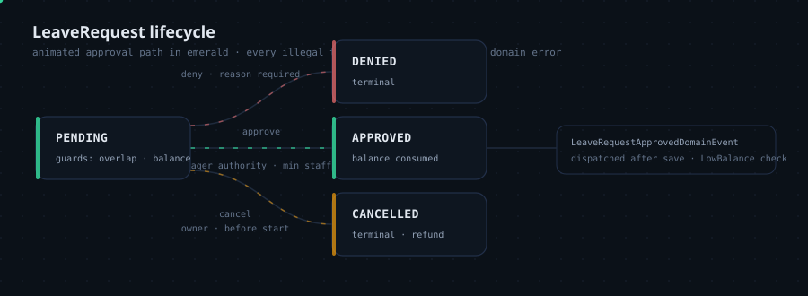

# LeaveLite MCP: the engineering view

The companion to the [README's product story](README.md). This page carries the engineering
depth: the architecture and how a tool call travels through it, the full MCP surface, every
major decision traced back to the leave problem it solves (each grounded in an ADR), the stack
rationale, the test tiers, and an honest statement of the security posture.

## Architecture


*Animated: the emerald request travels client → MCP host → handler → domain, the sky response
returns, and amber domain events feed the alert worker. Animations play directly on GitHub.
Every element maps to a real type in the solution.*

```
src/
├── LeaveLite.Domain/            # Pure model: aggregates, value objects,
│   ├── Balances/                #   AccrualBalanceCalculator (pure, deterministic)
│   ├── Specifications/          #   Eligibility + minimum-staffing, combinable
│   └── ...                      #   typed error catalog, domain events
├── LeaveLite.Application/       # Use cases: CQRS handlers, ports, validation
├── LeaveLite.Infrastructure/    # EF Core 10 + SQLite, migrations, event channel worker
└── LeaveLite.Server/            # MCP host: tools/resources/prompts over /mcp
tests/
├── LeaveLite.Domain.UnitTests/          # 166 tests: accrual math in depth
├── LeaveLite.Application.UnitTests/     # 60 tests: every use case, every branch
└── LeaveLite.Server.Tests/              # 27 tests: the official MCP client speaking
                                         #   the real protocol against the real host
```

In flow order:

- **`LeaveLite.Server`** is the MCP host: ASP.NET Core exposing tools, resources and prompts
  over stateless Streamable HTTP at `/mcp`. Tool classes are thin adapters that parse arguments
  and hand off to application handlers; they contain no business rules
  ([ADR 0002](docs/adr/0002-mcp-sdk-and-transport.md)).
- **`LeaveLite.Application`** holds the use cases as CQRS handlers with a uniform shape:
  validate → load → execute → persist → dispatch ([ADR 0004](docs/adr/0004-cqrs-without-mediator.md)).
- **`LeaveLite.Domain`** is the product: the accrual engine, eligibility and staffing
  specifications, the `LeaveRequest` state machine, the typed error catalog and domain events.
  It builds with a single package (ErrorOr) and has no knowledge of MCP, EF or HTTP
  ([ADR 0001](docs/adr/0001-clean-architecture.md), [ADR 0005](docs/adr/0005-accrual-engine-purity.md)).
- **`LeaveLite.Infrastructure`** implements the ports: EF Core 10 on SQLite with a checked-in
  migration, repositories, the domain-event channel and the low-balance alert worker
  ([ADR 0003](docs/adr/0003-sqlite-ef-core.md), [ADR 0007](docs/adr/0007-domain-events-channel.md)).

**Layering rule:** dependencies point inward. Swapping SQLite for PostgreSQL, or MCP for a REST
surface, touches only outer layers.

## How the tech solves the business problem

| Business problem | Engineering decision | Why this tech | What it buys | Where documented |
|---|---|---|---|---|
| The assistant must not "remember" the policy wrong | Clean architecture: a pure domain layer the protocol merely transports | Rules live where they are testable without a server; the domain has no knowledge of MCP, EF or HTTP | Every tool call runs the same rules a REST API would; swapping database or protocol touches outer layers only | [ADR 0001](docs/adr/0001-clean-architecture.md) |
| The server must scale with no session affinity, and every client must be able to connect | Official MCP C# SDK over stateless Streamable HTTP | Every POST is self-contained: no session bookkeeping, trivial load balancing, full protocol compliance without hand-rolled JSON-RPC | Claude Desktop, Claude Code and IDE agents connect as-is; integration tests skip session state | [ADR 0002](docs/adr/0002-mcp-sdk-and-transport.md) |
| A reviewer must be able to clone and run with zero infrastructure | SQLite behind EF Core with a real checked-in migration | `dotnet run` is the entire setup; the database migrates and seeds on first start | Evaluation costs nothing while real relational mapping decisions stay exercised; switching providers is a connection string plus one migration | [ADR 0003](docs/adr/0003-sqlite-ef-core.md) |
| Use cases need one uniform shape without magic | CQRS handlers without a mediator package | `ICommand`/`IQuery` records and handler interfaces registered by assembly scanning; no reflection pipeline | The rules stay findable: every use case is validate, load, execute, persist, dispatch, in one debuggable place | [ADR 0004](docs/adr/0004-cqrs-without-mediator.md) |
| Balance math must be exactly right, on any date | The accrual engine is a pure function with an injected clock | `asOf` is a parameter, never read from the system clock; every consumer that needs "now" gets it from `IDateTimeProvider` | The riskiest math is deterministic: same inputs, same balance; no test needs time travel; auditors get reproducibility | [ADR 0005](docs/adr/0005-accrual-engine-purity.md) |
| An AI client must explain failures instead of hallucinating them | Stable domain error codes surfaced verbatim through tool results | `ErrorOr` failures map to readable sentences prefixed with codes such as `LeaveRequest.OverlappingRequest` | The assistant relays *why* an action failed; tests and clients match codes instead of prose; authority, conflict and validation failures read distinctly | [ADR 0006](docs/adr/0006-error-surfacing.md) |
| Alerts must not block or break the request flow | Domain events over a bounded channel with a drop-write policy | `Channel<T>` (capacity 64) drained by a background worker; no broker to run | A low-balance warning never blocks a leave request, and the seam where email or Slack would plug in is explicit | [ADR 0007](docs/adr/0007-domain-events-channel.md) |
| "Works with the official client" must be tested, not hoped | Protocol-level integration tests using the official MCP C# client | `WebApplicationFactory` boots the real host; the SDK client speaks real Streamable HTTP through it | Transport, serialization, DI, seeding and rules are exercised together: the exact path Claude Desktop takes | [ADR 0008](docs/adr/0008-protocol-testing.md) |

The row that shaped the product most: error surfacing. MCP tool results are strings a model
reads; a generic "an error occurred" invites the model to invent an explanation, which in a
leave system is worse than no answer. Pairing a stable code with a human-readable sentence means
the assistant can quote the reason faithfully (`[LeaveRequest.MinimumStaffingNotMet]`, approval
denied) and tests can assert on the code while users read the sentence. The distinction matters
operationally too: an authorization failure (`Employee.ApproverNotTeamManager`) reads differently
from a conflict (overlap, staffing) and from input validation, mirroring HTTP semantics without
HTTP.

## Request and data flow

One representative path: the assistant books a day off, end to end.

1. The assistant emits `tools/call` (`request_leave`) over Streamable HTTP to `/mcp`. The POST
   is self-contained: stateless mode means no session handshake or affinity
   ([ADR 0002](docs/adr/0002-mcp-sdk-and-transport.md)).
2. The SDK resolves the tool from assembly-scanned tool classes (`WithToolsFromAssembly`; the
   SDK's `WithTools<T>()` rejects static classes, which is why scanning is the discovery route).
3. The tool adapter parses and validates the arguments, resolves the concrete
   `ICommandHandler<RequestLeaveCommand, LeaveRequestId>` from DI, and sends the command. Tools
   hold no rules; they translate.
4. The handler validates (FluentValidation), loads the employee and policy through repository
   ports, and calls the domain: overlap against existing requests, balance via the pure accrual
   engine, then the `LeaveRequest` factory creates a Pending request.
5. EF Core persists through the unit of work; the domain-event dispatcher logs every event and
   writes low-balance warnings into the bounded channel, which the `LowBalanceAlertWorker`
   drains in the background ([ADR 0007](docs/adr/0007-domain-events-channel.md)).
6. The result maps back through `ErrorOr`: success becomes a concise readable summary
   ("Leave request submitted... Status: Pending, awaiting a team manager's approval"), failure
   becomes a stable code plus a plain sentence ([ADR 0006](docs/adr/0006-error-surfacing.md)).
   Either way the assistant receives text it can act on.

**The domain in one paragraph.** Balances are computed, not stored: a pure accrual engine derives
accrued hours from the policy (tenure-gated monthly fractions or upfront grants, annual caps)
and subtracts approved leave measured in **working days**: weekends and organization holidays
never consume balance. `LeaveRequest` is a state machine (Pending → Approved/Denied/Cancelled)
whose transitions are illegal-transition-proof. Approval requires a same-team manager and a
`MinimumStaffingSpecification` check against the rest of the team's approved leave. Every
mutation runs through CQRS handlers returning typed `ErrorOr` results.

The leave-request lifecycle, animated:



## The MCP surface

The complete catalog the server advertises on connection:

| | Name | Purpose |
|---|---|---|
| Tool | `check_employee_balance` | Accrued / consumed / available hours per leave type |
| Tool | `forecast_balance` | Balance now vs. projected N months ahead |
| Tool | `request_leave` | Submit a leave request (overlap + balance guarded) |
| Tool | `cancel_leave_request` | Cancel pending, or approved-before-it-starts |
| Tool | `list_pending_approvals` | A manager's queue with hours and reasons |
| Tool | `decide_leave_request` | Approve/deny with authority + minimum-staffing enforcement |
| Tool | `get_team_calendar` | Who is out, holidays and working days per date |
| Tool | `list_holidays` | The organization's holiday calendar |
| Tool | `list_employees` / `who_reports_to_manager` | Directory data LLM callers need |
| Resource | `leavelite://policies`, `leavelite://teams`, `leavelite://holidays/{year}` | Reference data for client context |
| Prompt | `team-coverage-review` | Instructs an AI to audit coverage for a month using the tools |

Tool descriptions double as the product's UX for LLM callers: each one teaches when the tool
should be used, because a mis-invoked tool is a support ticket. Every failure surfaces as
readable text carrying a **stable domain error code**
(`[LeaveRequest.OverlappingRequest]`, `[Employee.ApproverNotTeamManager]`,
`[LeaveRequest.MinimumStaffingNotMet]`) so an AI client can explain *why* an action failed.

## Challenges worth reading

These came up during the build and are documented with their resolutions in the ADRs:

- **EF Core × rich constructors**: complex properties (`DateRange`) cannot be
  constructor-bound into aggregate constructors; aggregates carry private reconstitution
  constructors while factories remain the only business path.
- **Stateless HTTP vs. sessions**: stateless Streamable HTTP trades server affinity for
  trivial load balancing and simpler tests; the SDK's session semantics are available when
  needed.
- **Static tool classes**: the SDK's `WithTools<T>()` rejects static classes; assembly
  scanning is the supported discovery route.
- **Testing the transport, not the implementation**: the protocol suite connects the real
  SDK client through `WebApplicationFactory`'s in-memory server by injecting the factory's
  `HttpClient` into the transport (an API detail discovered against SDK 2.2.0).
- **Time correctness**: every clock read flows through `IDateTimeProvider`; the accrual
  engine takes `asOf` as a parameter, making the riskiest math pure and deterministic.
- **Error vocabulary for LLMs**: stable machine-readable codes paired with human-readable
  sentences, because an AI client must explain failures it didn't expect.

## Stack, and why

| Area | Choice and why |
|---|---|
| **.NET 10 / C# 14, ASP.NET Core** | The host and the language the whole solution is written in; CI builds with `--warnaserror`, so a warning fails the build |
| **ModelContextProtocol C# SDK 2.2.0** | Co-maintained by Microsoft and Anthropic: initialize handshake, capability negotiation and SSE responses without hand-rolled JSON-RPC ([ADR 0002](docs/adr/0002-mcp-sdk-and-transport.md)) |
| **EF Core 10 + SQLite** | Real migrations and mapping decisions, zero-ops evaluation; typed ids via value converters, `DateRange` as a complex property, holiday calendars as a JSON column ([ADR 0003](docs/adr/0003-sqlite-ef-core.md)) |
| **ErrorOr** | Typed results end to end: the domain returns errors as values, which is what makes [ADR 0006](docs/adr/0006-error-surfacing.md) possible |
| **FluentValidation** | Input validation composed explicitly inside handlers, no mediator pipeline ([ADR 0004](docs/adr/0004-cqrs-without-mediator.md)) |
| **xUnit v3 + NSubstitute** | Domain and application unit suites plus the protocol integration suite ([ADR 0008](docs/adr/0008-protocol-testing.md)) |
| **Serilog** | Structured console logging, including the alert worker's drop log |

## Testing

`dotnet test`, 253 tests, no setup required. Three tiers, each protecting something specific:

- **166 domain unit tests** on the pure accrual engine, state machine and specifications:
  tenure gates, carry-over at the year boundary, the Feb-28 clamp, exact 2-decimal mid-period
  fractions, every illegal transition. Plain data in, assertions out; no mocks, no time travel.
- **60 application unit tests** covering every use case and every branch, resolving handlers
  through the same DI registrations the server uses, so the test composition root is identical
  to production's.
- **27 protocol integration tests**: the differentiator. They boot the real host with
  `WebApplicationFactory` (unique seeded SQLite database per class) and connect the official
  MCP C# client over Streamable HTTP: initialize handshake, tool/resource/prompt discovery, a
  full write flow (request → pending list → approval → reduced balance), and domain error codes
  asserted through tool results, the exact experience a Claude client gets
  ([ADR 0008](docs/adr/0008-protocol-testing.md)).

## Security and operations

Stated honestly:

- **The demo runs without authentication.** `/mcp` is anonymous in Development; authentication
  was intentionally left out of the portfolio build
  ([ADR 0002](docs/adr/0002-mcp-sdk-and-transport.md) records the choice). A production
  deployment would add an auth gate in front of `/mcp` (the documented extension point is an
  OAuth resource server / bearer token check), TLS termination, and a managed database via the
  provider swap (connection string plus one migration). Nothing of that exists in this repo
  today; the README's curl example works precisely because the endpoint is open.
- **CI gates** ([ci.yml](.github/workflows/ci.yml)): `dotnet build --configuration Release
  --warnaserror` then `dotnet test`, on every push and pull request to main.
- **Operations**: stateless mode means any instance can serve any request, so horizontal
  scaling needs no session affinity. The alert channel is bounded with drop-write under
  sustained pressure: a warning may be dropped (never a request blocked), and the worker logs
  the drop so it is not silently lost ([ADR 0007](docs/adr/0007-domain-events-channel.md)).
- **Seeding** happens only on an empty database at Development startup, with dates computed
  relative to run time, so the demo data never goes stale and never overwrites real rows.

## Jargon

Terms used across this repo, from [accrual](docs/GLOSSARY.md) to
[bounded channel](docs/GLOSSARY.md) and [Streamable HTTP](docs/GLOSSARY.md), are defined in
the [glossary](docs/GLOSSARY.md), plain English first.
